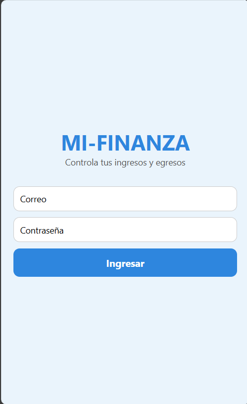
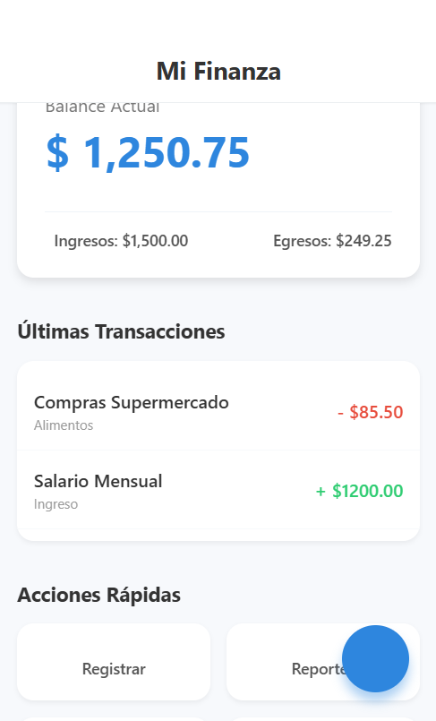
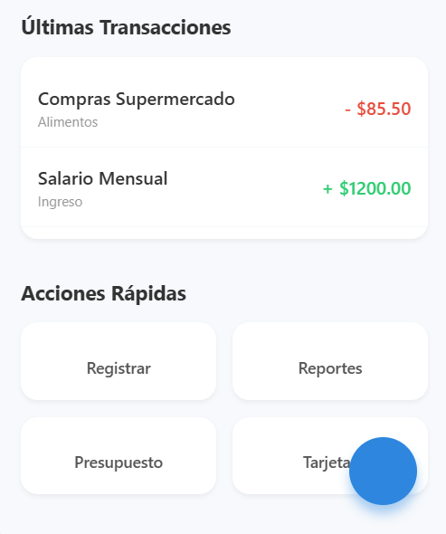
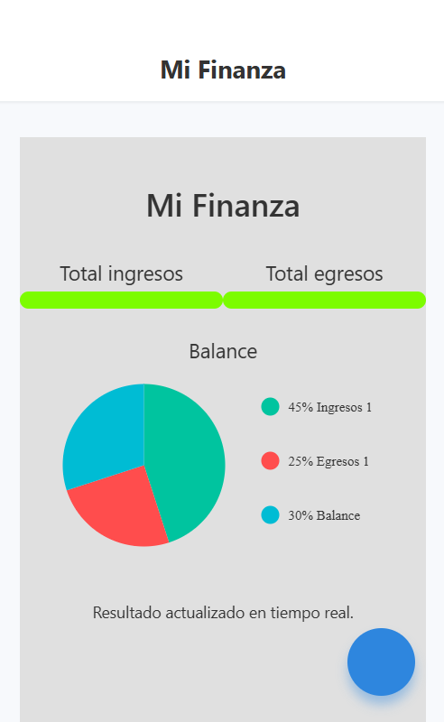

# App-movil---Electiva-V
Proyecto desarrollado sobre React Native para la asignatura Electiva V - Móviles.
# MI-FINANZA 

Aplicación móvil en desarrollo con Expo (React Native) para la gestión de ingresos y egresos de personas mayores de 50 años.

## Entregable 1 - Construcción inicial del producto móvil

## Acceso a la aplicacion
- Escribir correo: Admin@gmail.com
- Clave: 123456

### 1. Configuración del entorno
Se creó el proyecto usando **Expo con plantilla blank-typescript**.
Se organizaron las carpetas base (`components`, `screens`, `services`, `hooks`, `context`, `utils`).

### 2. Modulos
### 2.1 Componentes Reutilizables
- Button
- PieChart

### 2.2 Hooks
- useChartData
- useForm

### 2.3 Context
- AppContext

### 2.4 Carpeta Navigation
Carpeta para organizar la navegación de la APP
- RootNavigator

## Nota
Se crearon las carpetas services y utils, de momento sin contenido.
 

### 3. SCREENS EVIDENCIA
En la carpeta "assets/media/screens" están las capturas de cada componente

- **Login componente**

- **Initial componente**

- **Home componente**

- ** Features componente**

---------------------------------

Se implementó la pantalla Login aplicando:

- `useState` y `useEffect`
- `Props`
- `Custom Hook (useForm)`
- `Contexto global (AppContext)`
- Estilos simples con `StyleSheet`

El usuario puede ingresar con cualquier correo y la contraseña **123456**.
Se usa un contexto global para guardar el correo del usuario y mostrarlo en la pantalla Home.

-------------------------------------

Se implementó HomeScreen:

Home Screen (Gestión de Contenido)
Es el destino después de la autenticación. Su función es mostrar el valor central de la aplicación.

Cargar Datos: Ejecuta la lógica para descargar y mostrar la información principal (perfil, feeds, estadísticas, etc.).

Renderizar UI: Muestra la interfaz de usuario con widgets, íconos de navegación, y accesos directos a otras funcionalidades.

Meta Funcional: Servir como el centro de navegación y mostrar al usuario la información más relevante de un vistazo.

-------------------------------------

Se implementó FeaturesScreen

La interfaz inicial del mockup para mostrar las graficas de ingresos, egresos y otros datos de los gastos.

### 3. Próximos tareas

Andres Quiñonez
- Implementar servicios para SQLite
- Implementar el registro y manejo de ingresos/egresos usando listas 
- Agregar componentes reutilizables (botones, inputs).
- Crear servicios reales en `src/services/` para manejar la lógica de negocio.

Julio
- Implementar servicios para SQLite
- Formulario para registro de ingresos

Sebastian Zamora
- Implementar servicios para SQLite
- Formulario para registro de egresos

### 4. Equipo
- Andres Fernando Quiñonez Ruiz   
- Sebastian Zamora
- Julio Castillo

### 5. Profesor
- Víctor Pinto — *victorpinto@unimayor.edu.co*

---
Repositorio: [https://github.com/Sebasdroid98/App-movil---Electiva-V](https://github.com/Sebasdroid98/App-movil---Electiva-V)
